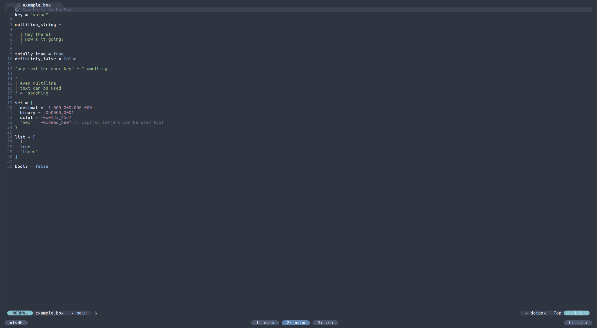

# dotbox.nvim

Neovim support for [DotBox](https://dotbox.dev).

## Features

- ✓ Highlights
- ✓ Folds
- ✓ Indents
- ✓ Locals
- ✖ Insertions

## Usage

This plugin should work with any plugin manager and does not require any setup. The
only requirement is that you have tree-sitter installed and configured. If you don't
build tree-sitter with support for the
[DotBox Tree-sitter grammar](https://github.com/jakehamilton/tree-sitter-dotbox)
then you will need to run `:TSInstall` to ensure that all parsers needed are available.
